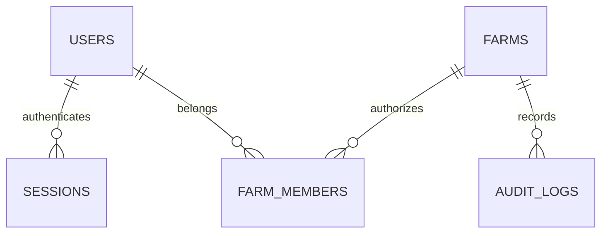

# DairyMonitor — implementation architecture

## Scope and phases
Phase 1: bilingual public website, authentication, tenant foundation, farm onboarding, protected dashboard. Phase 2: herd and lactations. Phase 3: milk records. Subsequent phases: health/breeding; inventory/feed; buyers/finance; staff/partners; reports; offline synchronization; AI; subscriptions/admin. Every phase requires integration verification before completion. Unimplemented modules remain explicitly planned.

## Boundaries
The isolated `frontend/` Next.js application renders the interface. The isolated `backend/` Express application owns validation, authentication, permissions, and database access. Each has its own manifest, lockfile, TypeScript configuration, environment, and build lifecycle. PostgreSQL is authoritative. The browser accesses the API through a same-origin /api proxy. Database-backed opaque sessions use HttpOnly cookies; this initial first-party web application does not need browser-stored JWTs. Future mobile clients may add scoped token authentication.

## Tenant model and ERD

Farm is the tenant. Membership grants OWNER or VIEWER in Phase 1. Owners create farms; members read only their farm. Later granular role tables replace these initial roles. Global users and sessions are not farm-owned. SQL uses parameter binding. All farm reads check membership. Composite constraints and database row security will be added before expanding farm-owned data modules.

## API contracts
POST /api/v1/auth/register {name,email,password}: 201 user; creates session.
POST /api/v1/auth/login {email,password}: 200 user; creates session.
GET /api/v1/auth/me: 200 user or 401.
POST /api/v1/auth/logout: 204; revokes session.
GET /api/v1/farms: current user's farms only.
POST /api/v1/farms {name,city,currency}: atomic farm, OWNER membership, audit event.
GET /api/v1/farms/:id: membership-authorized farm or 404.

## Security and operational decisions
Passwords are bcrypt hashed. Session tokens are random, stored hashed, expire after seven days, and use Secure cookies in production. Unsafe requests require an allowed Origin. Authentication is rate limited. No credentials are seeded. Database migrations are explicit. Financial and AI modules are not part of this initial implementation. Email verification/reset, MFA, granular RBAC, RLS, backups, offline sync, deployment hardening and production load testing are release blockers for public commercial launch.

## Planned calculations
Use PostgreSQL NUMERIC and decimal-safe backend arithmetic. Animal lifecycle, health and reproductive states are separate. Official finance is deterministic. AI calls authorized domain tools and cites underlying records. Offline writes require idempotency keys and record versions from the first operational module.

## Initial implementation verification
The implemented account/farm slice passes validation tests, production build, TypeScript, PostgreSQL API/integrity checks and Playwright browser tests. Full Phase 1 remains open for granular roles/invitations, email verification/reset, organization membership and database RLS. Operational modules have not started.
